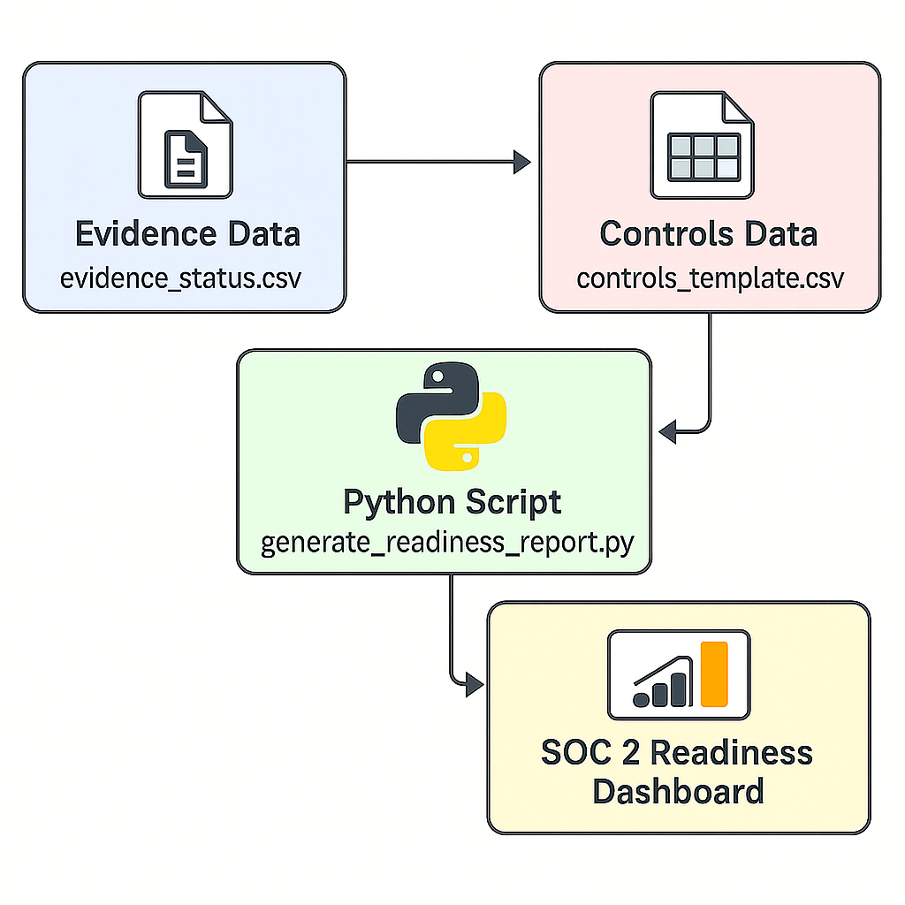
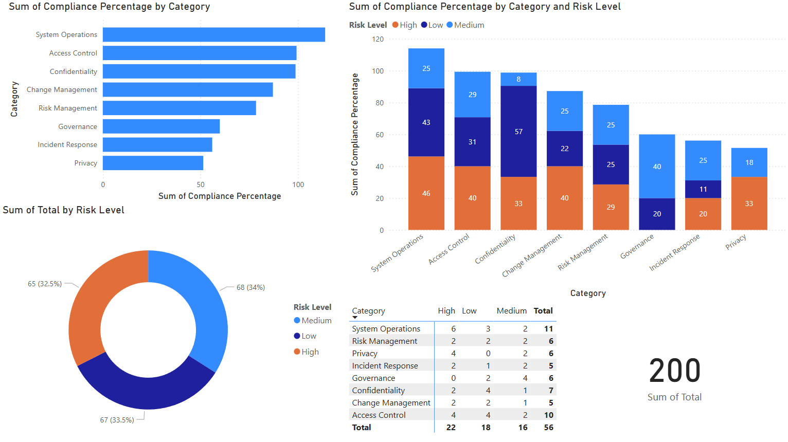

# SOC 2 Readiness Dashboard Automation (Python + Power BI)

## Overview

This project is designed to help organizations prepare for **SOC 2 audits** by automating the tracking, analysis, and reporting of compliance control data. Using **Python** for data transformation and **Power BI** for visualization, this tool helps stakeholders evaluate their SOC 2 readiness status across domains like Security, Availability, and Confidentiality.

It pulls control and evidence data from structured Excel/CSV files, calculates weighted compliance percentages, and presents the insights in an interactive dashboard—enabling audit teams and leadership to make informed decisions.

---

## Objectives

- Enable SOC 2 control readiness tracking in real-time
- Automate calculation of compliance metrics
- Visualize gaps by category and risk level
- Provide an audit-friendly evidence trail
- Deliver an intuitive Power BI interface for review

---

## Key Features

- Input via editable Excel and CSV files
- Python automation to compute compliance summaries
- Interactive Power BI dashboard with dynamic filters
- Weighted compliance percentage logic (not just averages)
- Audit-friendly structure with evidence-level tracking
- Easy to extend with Jira, Confluence, or Email integrations

---

## Target Users

- **Security & GRC Teams** — Track implementation status and review evidence
- **Auditors** — View verifiable control compliance
- **Managers** — Understand overall SOC 2 readiness
- **Developers** — Customize or extend automation via Python

---

## System Architecture

This architecture shows how data flows from control and evidence templates through Python scripts into Power BI:

---

## Example Power BI Dashboard

Below is a visual example of the SOC 2 Readiness Dashboard that displays control status, category-wise compliance, and risk segmentation:

---

## Breakdown of Components

### Controls Template (`controls_template.xlsx`)
A structured Excel file containing:
- Control ID, Category, Description
- Implementation Status
- Risk Level, Owner, Review Dates

### Evidence Status (`evidence_status.csv`)
Tracks:
- Submitted evidence files
- File metadata (type, size, submission date)
- Verification status and reviewer comments

### Python Scripts
- `generate_readiness_report.py`: Produces summary by category and risk
- `update_evidence_status.py`: Syncs evidence with control sheet
- `utils.py`: Helper functions for data loading and transformation

### Power BI Dashboard
Visualizes:
- KPI cards (Total, Implemented, Avg %)
- Bar charts (Category vs Compliance %)
- Matrix by Category & Risk Level
- Donut chart (Risk level distribution)

---

## Metrics Tracked

- Compliance % per category
- Total vs Implemented controls
- Breakdown by Risk Level
- Evidence verification status

---

## Getting Started

See the [README.md](../README.md) for full setup and execution instructions.
